<div align="center">

# Vijay Sai Chigullapally

**AI / Machine Learning Engineer** &nbsp;·&nbsp; Agentic AI &amp; GenAI Systems &nbsp;·&nbsp; Data Engineering

<picture>
  <source media="(prefers-color-scheme: dark)" srcset="./assets/hero-dark.svg" />
  
</picture>


[](https://portfolio-omega-six-j3zgm8e9ul.vercel.app)
[](https://www.linkedin.com/in/vijay-sai-chigullapally-63558521b/)
[](mailto:vijaysaichigullapally1@gmail.com)

</div>

## About

I'm Vijay Sai Chigullapally, recently completed my M.S. in Computer Science at the University of North Texas (4.0 GPA). I build end-to-end intelligent systems, focusing on agentic AI, autonomous LLM workflows, and data pipelines that run reliably in production. My work spans designing and optimizing deep learning architectures, data pipelines and scheduled autonomous multi-agent systems.

## Currently

```console
$ cat now.md

▸ building   Megatron  —  desktop control center for Claude Code skills
             Electron 39 + React 19 + SQLite, local-first linter & indexer
▸ shipping   PingBack  —  desktop alerts for AI coding agents (npm: pingback-cli)
             background monitor alerting when Claude Code needs attention
▸ open to    AI/ML · GenAI · Data Engineering roles (US, full-time)
```


## Tech Stack

**GenAI & LLM Systems**


**Machine Learning & Deep Learning**


**Data Engineering**


**Cloud, MLOps & Tooling**


## GitHub Activity

<div align="center">




</div>

## 🐍 Contribution Snake

<div align="center">

<picture>
  <source media="(prefers-color-scheme: dark)" srcset="https://raw.githubusercontent.com/vijaysai1102/vijaysai1102/output/github-snake-dark.svg"/>
  <source media="(prefers-color-scheme: light)" srcset="https://raw.githubusercontent.com/vijaysai1102/vijaysai1102/output/github-snake.svg"/>
  
</picture>

</div>

## Education

**M.S. Computer Science** · University of North Texas, Denton TX · *Graduated May 2026* · **GPA 4.0 / 4.0**

Certifications: Model Context Protocol (MCP) — Hands-On with Agentic AI · Machine Learning with Python: Foundations · ETL in Python and SQL

## Let's Talk

I'm available immediately for full-time **AI / Machine Learning Engineer**, **GenAI Engineer**, and **Data Engineer** roles in the US, and open to relocation. The fastest way to reach me is email — I reply to everything.

<div align="center">

[](mailto:vijaysaichigullapally1@gmail.com)
[](https://www.linkedin.com/in/vijay-sai-chigullapally-63558521b/)
[](https://portfolio-omega-six-j3zgm8e9ul.vercel.app)

<sub>

*Building AI systems that run without me.*


</sub>

</div>


